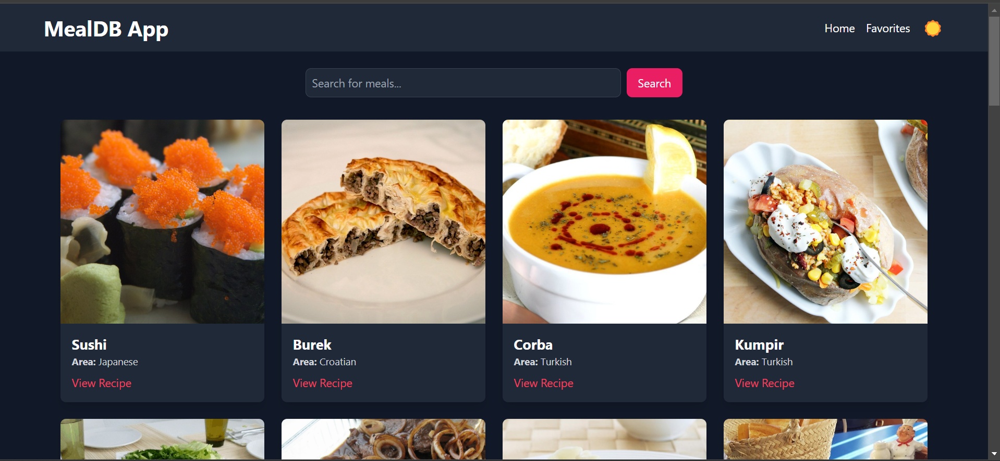
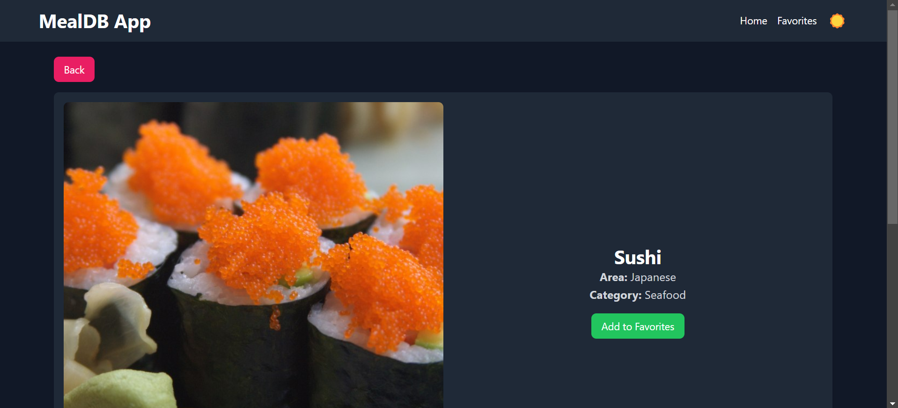
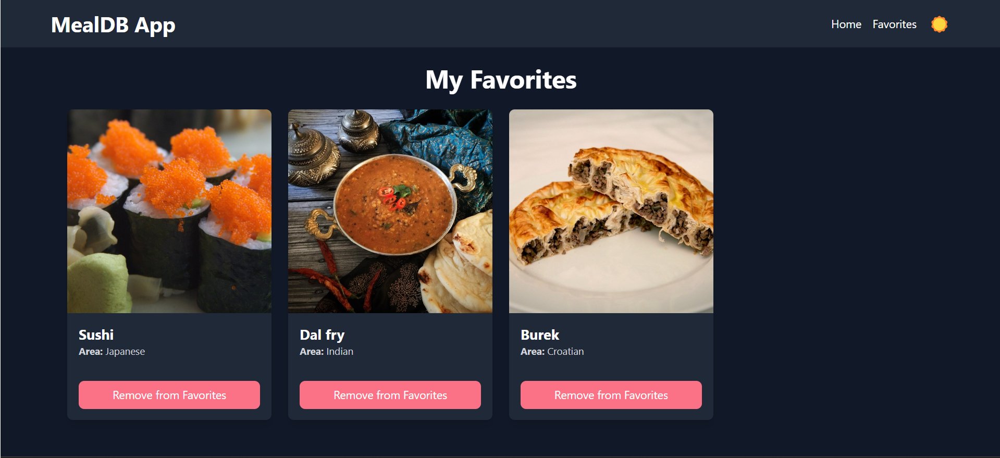

# MealDB App 🍲

A responsive React app to explore meal information, featuring dark mode, a search bar, favorites, and detailed meal views using TheMealDB API.

## Features
- **Home Page**: Displays meal results in responsive cards.
- **Search**: Filter meals by name.
- **Dark Mode**: Toggle between light and dark themes.
- **Favorites**: Save meals to a favorites list for easy access.
- **Meal Details**: View extended details about each meal on a dedicated page.

## Screenshots
  
*Home Page*

  
*Meal Details Page*

  
*Favorites Page*

## Installation

1. Clone the repository:
   ```bash
   git clone https://github.com/kraken300/MealsDB-API-React.git
   cd MealsDB-API-React
   ```

2. Install dependencies and start the app:
   ```bash
   npm install
   npm run dev
   ```

3. Open [http://localhost:5173](http://localhost:5173) in your browser.

## Tech Stack
- **Vite** for fast development with **React** & **React Router**
- **Tailwind CSS** for styling
- **TheMealDB API** for meal information

## Project Structure

```
src/
├── components/
│   └── Header.jsx           # Header component with dark mode toggle
├── pages/
│   ├── Home.jsx             # Home page with meal search and display
│   ├── Favorites.jsx        # Favorites page to view saved meals
│   └── MealDetail.jsx       # Detailed meal view with recipe info and video link
├── App.jsx                  # Main app file with routing
└── main.jsx                 # React entry point for Vite
```
